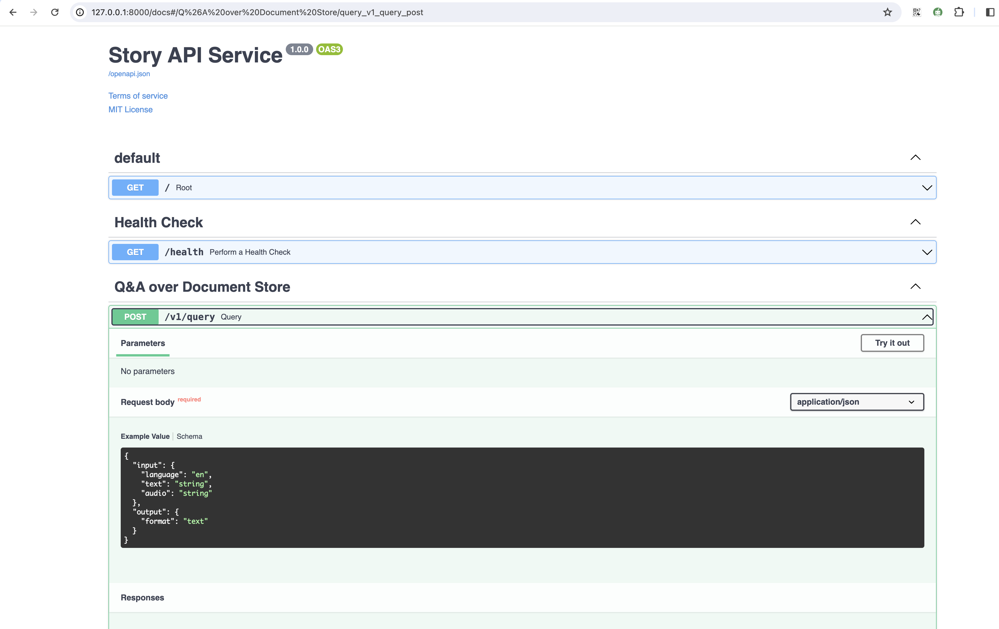

# Story API Service

Welcome to "Story Sakhi" service, your go-to solution for generating captivating and imaginative stories effortlessly. This innovative service is designed to cater to a diverse audience, ensuring an engaging storytelling experience for users of all backgrounds and interests.

What does the Service do?

"Story Sakhi" is a powerful tool crafted to breathe life into your ideas. Its primary function is to generate creative stories based on topics provided by the user.

### Key Features:

#### Creative Story Generation: 
The heart of "Story Sakhi" lies in its ability to generate unique and imaginative stories. Simply input a topic, and watch as the service weaves a narrative that captivates and inspires.

#### LLM Capabilities: 
Leveraging the latest in Language Model technology, "Story Sakhi" boasts advanced capabilities for Language Model-driven storytelling. This ensures a rich and coherent narrative that aligns seamlessly with your input.

#### Multilingual Support: 
"Story Sakhi" goes beyond linguistic barriers by supporting Indic languages. Now, you can explore creative storytelling in languages such as Hindi, Tamil, Bengali, and various other Indic languages, broadening the horizons of your imaginative journey.

#### Versatile Input and Output: 
"Story Sakhi" understands the diversity of user preferences. Whether you prefer to communicate through text or voice, the service supports both audio and text queries and provides responses in your preferred format.

Who can benefit?

"Story Sakhi" is designed for a broad audience. Parents, Teachers, Students, or anyone with a passion for storytelling can harness the power of our service.

#### How to Get Started:

Using "Story Sakhi" is a breeze. With user-friendly interfaces and straightforward instructions, you can dive into the world of limitless storytelling in no time. Simply provide a topic, and let the magic unfold.

Unleash your creativity with "Story Sakhi" and experience the joy of storytelling like never before. The possibilities are endless, and the stories are yours to create!

### Prerequisites

- **Python 3.7 or higher**
- Latest Docker

### [Marqo database setup](https://docs.marqo.ai/1.5.0/#setup-and-installation)

1. To get the Marqo image, use the following command:

```shell
docker pull marqoai/marqo:latest
```

2. To create the Marqo instance, run the following command:

```shell
docker run --name marqo --privileged \
  -p 8882:8882 \
  --add-host host.docker.internal:host-gateway \
  -d marqoai/marqo:latest
```

# 🔧 1. Installation

To use the code, you need to follow these steps:

1. Clone the repository from GitHub: 
    
    ```bash
    git clone https://github.com/DJP-Digital-Jaaduii-Pitara/story-api-service.git
    ```
    ```
   cd story-api-service
   ```

2. The code requires **Python 3.7 or higher** and some additional python packages. To install these packages, run the following command in your terminal:

    ```bash
    pip install -r requirements-dev.txt
    ```

3. To injest data to marqo

    ```bash
    python3 index_documents.py --marqo_url=<MARQO_URL> --index_name=<MARQO_INDEX_NAME> --folder_path=<PATH_TO_INPUT_FILE_DIRECTORY> --fresh_index
    ```
   --fresh_index: This is a flag that creating a new index or overwriting an existing one. Fresh indexing typically starts from scratch without using existing data.
   PATH_TO_INPUT_FILE_DIRECTORY should have only PDF, audio, video and txt file only.

   e.g.
   ```bash
   python3 index_documents.py --marqo_url=http://0.0.0.0:8882 --index_name=sakhi_rstory --folder_path=story_pdfs --fresh_index
   ```
   Create the index by using the above command. After creating the index add the index name in `config.ini` file.

   ```json
   [marqo]  
   index_name=<STORY_INDEX_NAME>
   ```

4. You will need an OCI account to store the audio file for response.

5. create another file **.env** which will hold the development credentials and add the following variables. Update the Azure OpenAI details, OCI object storage details and bhashini endpoint URL and API Key.

    ```bash
    OPENAI_API_BASE=<your_azure_openai_api_base_url>
    OPENAI_API_VERSION=<your_azure_api_version>
    OPENAI_API_KEY=<your_azure_api_key>
    GPT_MODEL=<your_gpt_model>
    LOG_LEVEL=<log_level>  # INFO, DEBUG, ERROR
    BHASHINI_ENDPOINT_URL=<your_bhashini_endpoint_url>
    BHASHINI_API_KEY=<your_bhashini_api_key>
    OCI_ENDPOINT_URL=<oracle_bucket_name>
    OCI_REGION_NAME=<oracle_region_name>
    OCI_BUCKET_NAME=<oracle_bucket_name>
    OCI_SECRET_ACCESS_KEY=<oracle_secret_access_key>
    OCI_ACCESS_KEY_ID=<oracle_access_key_id>
    SERVICE_ENVIRONMENT=<environment_name>
    MARQO_URL=<your_marqo_db_url>
    TELEMETRY_ENDPOINT_URL=<telemetry_service_base_url>
    TELEMETRY_LOG_ENABLED=<true_or_false>
    ```

# 🏃🏻 2. Running

Once the above installation steps are completed, run the following command in home directory of the repository in terminal

```bash
uvicorn main:app
```

Open your browser at http://127.0.0.1:8000/docs to access the application.

The command `uvicorn main:app` refers to:

- `main`: the file `main.py` (the Python "module").
- `app`: the object created inside of `main.py` with the line `app = FastAPI()`.
- `--reload`:  make the server restart after code changes. Only do this for development.
    ```bash
    uvicorn main:app --reload
    ```




# 📃 3. API Specification and Documentation

### `POST /v1/query`

#### API Function
API is used to generate activity/story based on user query and translation of text/audio from one language to another language in text/audio format. To achieve the same, Bhashini has been integrated. OCI object storage has been used to store translated audio files when audio is chosen as target output format.

```commandline
curl -X 'POST' \
  'http://127.0.0.1:8000/v1/query' \
  -H 'accept: application/json' \
  -H 'Content-Type: application/json' \
  -d '{
  "input": {
    "language": "en",
    "text": "string",
    "audio": "string"
  },
  "output": {
    "format": "text"
  }
}'
```

#### Request
| Request Input      |                                                       Value |
|:-------------------|----------------------------------|
| input.language     | en,bn,gu,hi,kn,ml,mr,or,pa,ta,te |
| input.text         | User entered question (any of the above language) |
| input.audio        | Public file URL Or Base64 encoded audio |
| output.format      | text or audio |

Required inputs are 'text', 'audio' and 'language'.

Either of the `text`(string) or `audio`(string) should be present. If both the values are given, `text` is taken for consideration. Another requirement is that the `language` should be same as the one given in text and audio (i.e, if you pass English as `language`, then your `text/audio` should contain queries in English language). The audio should either contain a publicly downloadable url of mp3 file or base64 encoded text of the mp3.
If output format is given as `text` than response will return text format only. If output format is given as `audio` than response will return text and audio both.

```json
{
   "input": {
      "text": "How to Teach Kids to Play Games", 
      "language": "en"
   },
   "output": {
      "format": "text"
   }
}
```

#### Successful Response

```json
{
  "output": {
    "text": "string",
    "audio": "string",
    "language": "en",
    "format": "text|audio"
  }
}
```

#### What happens during the API call?

Once the API is hit with proper request parameters, it is then checked for the presence of query_text. 

If query text is present, the translation of query text based on input language is done. Then the translated query text is given to langchain model which does the same work as `/query-with-langchain` endpoint. Then the paraphrased answer is again translated back to input_language. If the output_format is voice, the translated paraphrased answer is then converted to a mp3 file and uploaded to an OCI folder and made public.

If the query text is absent and audio url is present, then the audio url is downloaded and converted into text based on the input language. Once speech to text conversion in input language is finished, the same process mentioned above happens. One difference is that by default, the paraphrased answer is converted to voice irrespective of the output format since the input format is voice.

---

# 🚀 4. Deployment

This repository comes with a Dockerfile. You can use this dockerfile to deploy your version of this application to Cloud Run.
Make the necessary changes to your dockerfile with respect to your new changes. (Note: The given Dockerfile will deploy the base code without any error, provided you added the required environment variables (mentioned in the .env file) to either the Dockerfile or the cloud run revision)


# 5. Configuration (config.ini)

| Variable                        | Description                                                                                    | Default Value                        |
|:--------------------------------|------------------------------------------------------------------------------------------------|--------------------------------------|
| database.index_name             | index or collection name to be referred to from vector database for rstory flow                |                                      |
| database.top_docs_to_fetch      | Number of filtered documents retrieved from vector database to be passed to Gen AI as contexts | 5                                    |
| database.docs_min_score         | Minimum score of the documents based on which filtration happens on retrieved documents        | 0.4                                  |
| request.supported_lang_codes    | Supported languages by the service                                                             | en,bn,gu,hi,kn,ml,mr,or,pa,ta,te     |
| request.support_response_format | Supported response formats                                                                     | text,audio                           |
| llm.gpt_model                   | Gen AI GPT Model value                                                                         |                                      |
| llm.enable_bot_intent           | Flag to enable or disable verification of user's query to check if it is referring to bot      | false                                |
| llm.intent_prompt               | System prompt to Gen AI to verify if the user's query is referring to the bot                  |                                      |
| llm.bot_prompt                  | System prompt to Gen AI to generate responses for user's query related to bot                  |                                      |
| llm.story_prompt                | System prompt to Gen AI to generate story based on user's query                                |                                      |
| llm.rstory_prompt               | System prompt to Gen AI to generate story based on user's query and input contexts             |                                      |
| telemetry.telemetry_log_enabled | Flag to enable or disable telemetry events logging to Sunbird Telemetry service                | true                                 |
| telemetry.environment           | service environment from where telemetry is generated from, in telemetry service               | dev                                  |
| telemetry.service_id            | service identifier to be passed to Sunbird telemetry service                                   |                                      |
| telemetry.service_ver           | service version to be passed to Sunbird telemetry service                                      |                                      |
| telemetry.actor_id              | service actor id to be passed to Sunbird telemetry service                                     |                                      |
| telemetry.channel               | channel value to be passed to Sunbird telemetry service                                        |                                      |
| telemetry.pdata_id              | pdata_id value to be passed to Sunbird telemetry service                                       |                                      |
| telemetry.events_threshold      | telemetry events batch size upon which events will be passed to Sunbird telemetry service      | 5                                    |

## Feature request and contribution

*   We are currently in the alpha stage and hence need all the inputs, feedbacks and contributions we can.
*   Kindly visit our project board to see what is it that we are prioritizing.

 
